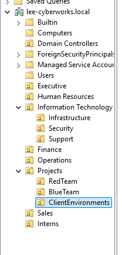

# Lee-CyberWorks-Mock-Company
I am creating a mock company called Lee Cyberworks on Windows Server and Active Directory.

This will be the foundation for my mock company directory.

The internal AD domain was already set as MyDomain.local, however, I recreated all three VMs to create the Lee-Cyberworks.local domain.

The Organizational Units will be as follows:
Lee CyberWorks Inc
* Executive
* HR
* IT
  - Infrastructure
  - Security
  - Support
* Finance
* Operations
* Projects
  - RedTeam
  - BlueTeam
  - ClientEnvironments
* Sales
* Interns

| OU Name        | Description                                                                                                         | Example GPOs                                         |
| -------------- | ------------------------------------------------------------------------------------------------------------------- | ---------------------------------------------------- |
| **Executive**  | CEO, CTO, and management staff.                                                                                     | Drive mapping, restricted PowerShell access.         |
| **HR**         | Handles employee onboarding, compliance, and internal policies.                                                     | Password policies, folder redirection.               |
| **IT**         | Split into Infrastructure (servers/networks), Security (pentesting, monitoring), and Support (help desk).           | Separate GPOs per sub-OU for permissions and access. |
| **Finance**    | Payroll and budgeting staff.                                                                                        | Encryption policies, mapped finance share.           |
| **Operations** | Handles project logistics, procurement, and scheduling.                                                             | Standard workstation restrictions.                   |
| **Projects**   | Simulates client work environments. Includes Red Team (offensive), Blue Team (defensive), and Client sandbox areas. | Network segmentation, least privilege enforcement.   |
| **Sales**      | Handles customer acquisition, client relations, and service contracts.                                              | Basic user settings, Outlook configuration.          |
| **Interns**    | Entry-level users with restricted privileges.                                                                       | Heavily restricted GPOs, limited network access.     |

| Department / OU                   | Full Name          | Title                          | Username          |
| --------------------------------- | ------------------ | ------------------------------ | ----------------- |
| **Executive**                     | Ted Lee            | Chief Executive Officer (CEO)  | ted.lee           |
| **Executive**                     | Sarah J. Kim       | Chief Technology Officer (CTO) | sarah.j.kim       |
| **Executive**                     | David L. Chen      | Chief Operating Officer (COO)  | david.l.chen      |
| **Executive**                     | Olivia F. West     | Executive Assistant            | olivia.f.west     |
| **HR**                            | Natalie R. Ortiz   | HR Manager                     | natalie.r.ortiz   |
| **HR**                            | Leo M. Carter      | HR Assistant                   | leo.m.carter      |
| **HR**                            | Monica D. Kim      | Recruiting Specialist          | monica.d.kim      |
| **HR**                            | Jordan P. Torres   | Training Coordinator           | jordan.p.torres   |
| **Finance**                       | Grace E. Thompson  | Chief Financial Officer (CFO)  | grace.e.thompson  |
| **Finance**                       | Victor T. Chen     | Accountant                     | victor.t.chen     |
| **Finance**                       | Henry M. Price     | Billing Specialist             | henry.m.price     |
| **Finance**                       | Sofia R. Patel     | Financial Analyst              | sofia.r.patel     |
| **IT / Infrastructure**           | Daniel P. Wright   | Systems Administrator          | daniel.p.wright   |
| **IT / Infrastructure**           | Olivia S. Perez    | Network Engineer               | olivia.s.perez    |
| **IT / Infrastructure**           | Kevin S. Ward      | Server Specialist              | kevin.s.ward      |
| **IT / Infrastructure**           | Isaac J. Morgan    | Systems Analyst                | isaac.j.morgan    |
| **IT / Security**                 | Marcus J. Santos   | Security Analyst               | marcus.j.santos   |
| **IT / Security**                 | Patrick O. Greene  | Penetration Tester             | patrick.o.greene  |
| **IT / Security**                 | Rachel K. Ford     | SOC Analyst                    | rachel.k.ford     |
| **IT / Security**                 | Benjamin R. Carter | Security Engineer              | benjamin.r.carter |
| **IT / Support**                  | Chloe L. Rivera    | Help Desk Lead                 | chloe.l.rivera    |
| **IT / Support**                  | Ethan R. Brooks    | Help Desk Technician           | ethan.r.brooks    |
| **IT / Support**                  | Emily R. Flores    | Desktop Support Specialist     | emily.r.flores    |
| **IT / Support**                  | Nathan G. Stewart  | Field Technician               | nathan.g.stewart  |
| **Operations**                    | Anthony Q. Clark   | Operations Manager             | anthony.q.clark   |
| **Operations**                    | Tina K. Patel      | Logistics Coordinator          | tina.k.patel      |
| **Operations**                    | Paul M. Turner     | Asset Manager                  | paul.m.turner     |
| **Operations**                    | Sophia J. Ramirez  | Office Coordinator             | sophia.j.ramirez  |
| **Sales**                         | Brandon M. Lee     | Sales Manager                  | brandon.m.lee     |
| **Sales**                         | Rachel A. Nguyen   | Account Executive              | rachel.a.nguyen   |
| **Sales**                         | Henry J. Owens     | Sales Associate                | henry.j.owens     |
| **Sales**                         | Olivia R. Bennett  | Marketing Specialist           | olivia.r.bennett  |
| **Projects / RedTeam**            | Isabella M. Flores | Red Team Engineer              | isabella.m.flores |
| **Projects / RedTeam**            | Jason P. Cole      | Red Team Lead                  | jason.p.cole      |
| **Projects / BlueTeam**           | Noah J. Johnson    | Blue Team Engineer             | noah.j.johnson    |
| **Projects / BlueTeam**           | Priya V. Shah      | Blue Team Lead                 | priya.v.shah      |
| **Projects / ClientEnvironments** | Jared M. Nichols   | Client Support Technician      | jared.m.nichols   |
| **Projects / ClientEnvironments** | Jacob H. Miller    | Client Environment Engineer    | jacob.h.miller    |
| **Interns**                       | Emily S. Torres    | Security Intern                | emily.s.torres    |
| **Interns**                       | Daniel L. Scott    | IT Intern                      | daniel.l.scott    |

